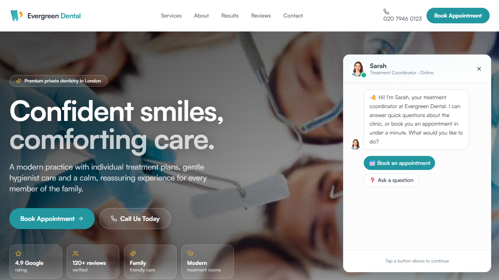
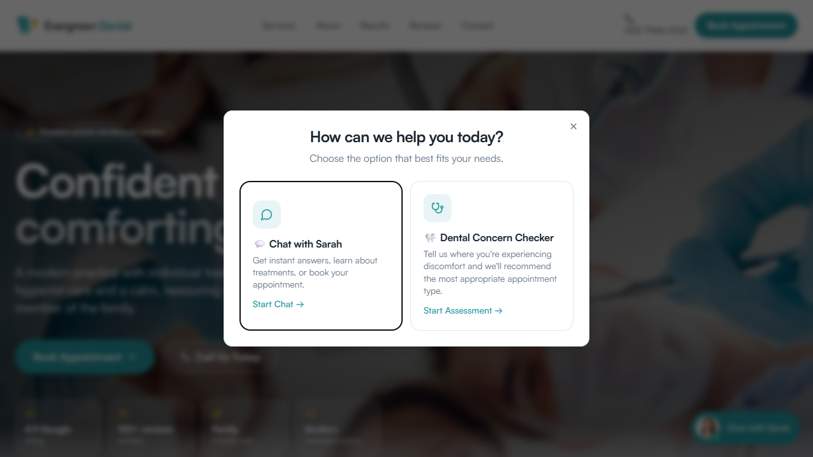

# Evergreen Dental — Conversion-Focused Dental Website

A modern, single-page-app website for a premium private dental practice
(**Evergreen Dental**, Marylebone, London). Every element is built to do one job:
**turn visitors into booked appointments.** It pairs a polished marketing site with an
AI booking assistant, an interactive symptom triage tool, and behaviour-based engagement
prompts.

🔗 **Live demo:** [my-dental.space](https://my-dental.space/)



---

## Why this exists

Most dental sites are brochures. This one is a **conversion machine**: it answers
questions instantly, triages dental concerns, and books appointments without the visitor
ever leaving the page or waiting for a callback. It's a demo/reference implementation you
can fork and adapt for any appointment-based local business.

## Conversion features

| Feature | What it does |
|---------|--------------|
| 🗨️ **"Sarah" AI chat assistant** | A guided treatment-coordinator chatbot. Answers FAQs (intent detection over an FAQ tree), explains treatments, and runs a full **book-in-under-a-minute** flow: email → OTP verification → name → treatment → date → time → notes → confirm. Also handles **returning patients** (reschedule). |
| 🦷 **Dental Concern Checker** | Interactive triage: pick the affected tooth on a tooth map, symptoms, onset and severity. Produces a summary and routes the visitor straight into booking or chat — with an emergency phone CTA for urgent cases. See the full walkthrough at the end of this README. |
| 🔔 **Engagement Orchestrator** | Behaviour-driven prompts. Timed "Sarah" notifications, re-engagement based on dwell time and scroll depth, and a help modal — all with cooldowns, frequency caps, and `localStorage` so visitors aren't nagged. |
| 📅 **Booking system** | `zod`-validated booking form (name, phone, email, treatment, date/time, notes), backed by Supabase, with prefill from the chat and concern-checker flows. |
| ⭐ **Trust & proof** | Trust bar (Google rating, review count), before/after case gallery, patient testimonials, team profiles. |
| 📞 **Mobile call banner** | Sticky one-tap "call now" for mobile visitors. |

## Pages

`/` Home · `/services` & `/services/:slug` · `/about` · `/team` · `/results` (before &
after) · `/reviews` · `/contact` · `/book` · `/unsubscribe` · 404.

---

## Tech stack

- **React 18** + **TypeScript** + **Vite 5**
- **Tailwind CSS** + **shadcn/ui** (Radix primitives)
- **Framer Motion** (animation), **React Router v6**, **TanStack Query**
- **React Hook Form** + **Zod** (forms & validation)
- **Supabase** (booking storage + email OTP verification)
- **Vitest** + Testing Library (tests)
- SEO: `react-helmet-async`, JSON-LD structured data, `sitemap.xml`, `robots.txt`,
  and an **`llms.txt`** for AI crawlers
- Built with [Lovable](https://lovable.dev)

## Project structure

```
src/
├── components/
│   ├── chat/                 # Sarah AI assistant (SarahChat.tsx + script.ts dialogue/logic)
│   ├── concern-checker/      # Tooth-map symptom triage (ConcernCheckerModal, ToothMap)
│   ├── engagement/           # Proactive prompts (Orchestrator, notifications, modal)
│   ├── services/             # Booking modal/provider, service modal
│   ├── sections/             # Home sections: Hero, Services, Team, Testimonials, ...
│   ├── layout/               # SiteLayout
│   └── ui/                   # shadcn/ui components
├── pages/                    # Routed pages
├── assets/                   # Images (team, cases, etc.)
└── integrations/supabase/    # Supabase client
public/                       # llms.txt, sitemap.xml, robots.txt, og-image, favicon
```

---

## Getting started

**Prerequisites:** Node 18+ (or [Bun](https://bun.sh)).

```bash
git clone https://github.com/dennis299/Dental-website-demo.git
cd Dental-website-demo
npm install          # or: bun install
cp .env.example .env # then fill in your Supabase values (see below)
npm run dev          # http://localhost:8080
```

### Scripts
| Command | Purpose |
|---------|---------|
| `npm run dev` | Start the Vite dev server |
| `npm run build` | Production build |
| `npm run preview` | Preview the production build |
| `npm run lint` | ESLint |
| `npm run test` | Run Vitest tests |

### Environment variables

The chat and booking flows talk to Supabase. Create a `.env` with:

```
VITE_SUPABASE_URL=your-project-url
VITE_SUPABASE_PUBLISHABLE_KEY=your-publishable-anon-key
VITE_SUPABASE_PROJECT_ID=your-project-id
```

> These are `VITE_`-prefixed, so they're bundled into the client and are **public by
> design** — the publishable/anon key is meant to be exposed and must be protected by
> Supabase Row-Level Security. Even so, prefer not to commit your real `.env`; keep it
> gitignored and commit only `.env.example`. Without Supabase configured, the marketing
> site still renders — only the live booking/OTP calls won't complete.

---

## SEO & AI discoverability

Built to be found by both search engines and AI agents:
- Per-page `<title>`/meta and Open Graph tags via `react-helmet-async`
- JSON-LD structured data (LocalBusiness / WebPage)
- `sitemap.xml` + `robots.txt`
- **`llms.txt`** — a clean, structured site summary for LLM crawlers

## Deployment

Deployed via Lovable to [my-dental.space](https://my-dental.space/). The Vite build
output (`dist/`) is static and can be hosted anywhere (Vercel, Netlify, Cloudflare Pages).

## Roadmap ideas

- Connect the chatbot/booking to a real CRM and calendar
- Outbound appointment reminders (SMS / call)
- Analytics dashboard for conversion funnel
- A/B test engagement triggers

## License

Demo/portfolio project — fork it and build your own version. (Add a license file if you
intend others to reuse it explicitly.)

---

## Engagement pop-up & Dental Concern Checker — full walkthrough

When a visitor lands and stays a while (dwell time + scroll depth, with cooldowns so it
only shows when appropriate), the **Engagement Orchestrator** surfaces a help pop-up that
gives the visitor two fast paths to convert.

### The engagement pop-up

> **How can we help you today?** — _Choose the option that best fits your needs._

| Option | Description | Action |
|--------|-------------|--------|
| 💬 **Chat with Sarah** | Get instant answers, learn about treatments, or book your appointment. | **Start Chat** → opens the Sarah AI assistant |
| 🦷 **Dental Concern Checker** | Tell us where you're experiencing discomfort and we'll recommend the most appropriate appointment type. | **Start Assessment** → opens the 4-step checker |



### The Dental Concern Checker (4 steps)

A guided self-triage tool that turns "something hurts" into a structured summary and a
booked appointment. Every step shows the disclaimer:
_"This assessment is for guidance only and does not provide a medical diagnosis."_

**Step 1 of 4 — Where is the discomfort?**
An interactive tooth map (FDI tooth numbering). The visitor taps any affected teeth, or
uses quick-select regions: **Upper Right, Upper Left, Lower Left, Lower Right, Front
Teeth, Gums / Whole mouth.** Selected teeth are listed live.

**Step 2 of 4 — What are you experiencing?** _(select all that apply)_
**Pain, Sensitivity, Swelling, Bleeding, Broken Tooth, Loose Tooth, Cosmetic Concern,
Missing Tooth, Other.**

**Step 3 of 4 — A few quick questions**
- **When did it start?** Today / This week / This month / Longer
- **Does hot or cold make it worse?** Yes / No / Unsure
- **Any visible swelling?** Yes / No
- **Is this an emergency?** Yes / No

**Step 4 of 4 — Recommendation & handoff**
- If the visitor flagged an emergency, a red call-out appears:
  _"If this feels like an emergency, please call us right away"_ with a tap-to-call number.
- A plain-language recommendation (e.g. "we recommend scheduling an examination… Sarah can
  help you book the most appropriate appointment").
- A **"Summary we'll pass to Sarah"** block consolidating everything: affected area &
  teeth, symptoms, onset, hot/cold sensitivity, swelling, and emergency flag.
- Two CTAs: **Book Appointment** or **Chat with Sarah** — and the collected summary is
  carried into whichever flow the visitor picks, so they never repeat themselves.

This is the core conversion loop: a worried visitor self-describes their problem, gets
reassurance and a clear next step, and lands in booking with their context pre-filled.
